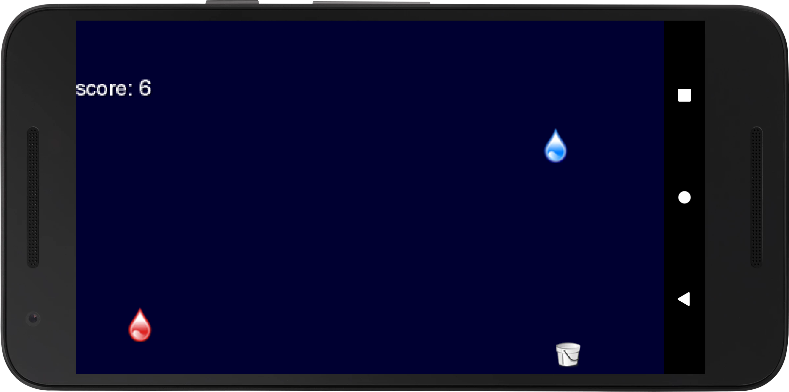

# Raindrops
Raindrops is an Android game where a bucket is dragged across the screen to catch good raindrops and avoid bad raindrops.
## Game Mechanics 
1. As a player drags their finger across the screen, a bucket moves to catch raindrops. 
2. If a blue raindrop is caught, the score increments by 1. 
3. If a blue raindrop reaches the end of the screen without being caught, the scored decrements by 1. 
4. If a red raindrop is caught, the score returns to the previous multiple of 10. 
5. If a red raindrop reaches the end of the screen without being caught, there is no penalty. 
6. Each time the score reaches a multiple of 10, the speed at which raindrops fall and spawn increases. 
## Screenshot

## Resources
This game was made with libGdx: https://libgdx.badlogicgames.com/
Based on this project: https://github.com/libgdx/libgdx/wiki/A-Simple-Game
